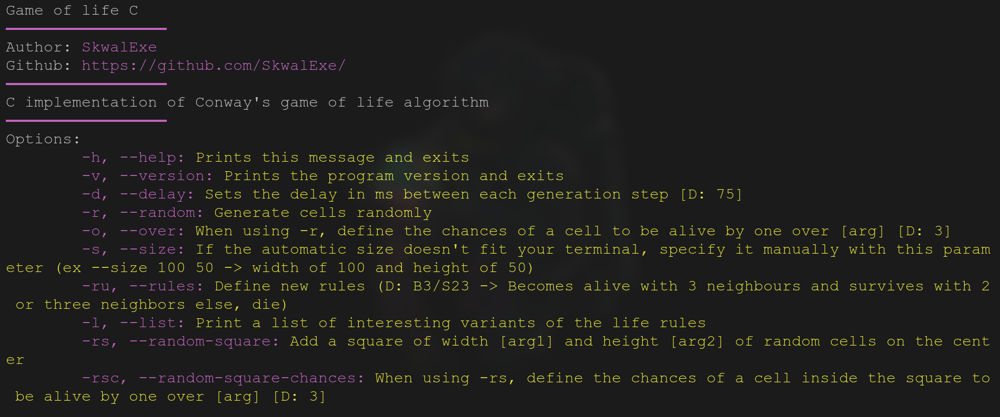
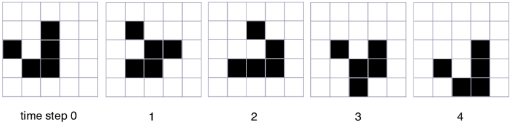

# Conway's Game of Life Simulator

This was my submission for the Harvard CS50x final project.

**Video Demo: https://youtu.be/KB4p_-KxPt4**

This program is a terminal application made in C that simulates the Conway's Game of Life Cellular automaton

# Installation 📦

## Build 🛠️

```bash
make
```

## Installation (add to bin folder)

```bash
make install
```

# Usage



# What is a Cellular Automaton
- A grid of cells that can have **two or more states** (e.g. Living or Dead)
- The grid's state changes during each generation depending on **certain rules**
- Cellular automata fascinates researchers because of the **very complex behaviours** that can emerge from **very simple rules**
  
# Game of Life's Rules
The rules of the Game of Life cellular automaton are very simple.

Every cell interacts with its eight neighbours, which are the cells that are horizontally, vertically and diagonally adjacent.

- Any living cell with two or three live neighbours survives
- Any dead cell with three live neighbours becomes a live cell
- Any other cell die

 

# Defferent entities
An entity is a pattern of cells that have a certain behaviour

There are multiple types of entities for example : 

- Oscillators : patterns that changes but repeat themselves after a particular number of generation (period)


- Still life : a stable pattern in which no changes follow the initial configuration


- Gliders : a glider will move across the environment as a parsistent entity
- 


# Very complex behaviour

Here are two examples of very complex behaviours that have been discovered : 

- The glider gun : A patter that generates gliders 


- Life in Life : One day, big brain people discovered a way to create logic gates in the Life (abreviation for game of life), and logic gates are the essense of computers, with logic gates, you can create computers. So these people used Life as sort of a programming language and coded a simulation of the game of life, inside of the game of life. And **THIS** is an example of the very complex behaviours that I am talking about!
https://www.youtube.com/watch?v=xP5-iIeKXE8

# Structure of the project

## `src/main.c`

This file manages argument parsing, and is used for starting the simulation

## `src/utils.c`

This file contains usefull fonctions such as `sleep_ms`, `clear_terminal` and more so that the `main.c` file is not too long

## `src/life.c`

This file contains all the logic of the game of life

# Uninstall

```bash
# 📂 game-of-life-c
make uninstall
# This will just delete /usr/bin/
```

# final

If you have any problem, dont hesitate to open an issue.

# contributing

Pull requests are welcome. For major changes, please open an issue first to discuss what you would like to change.